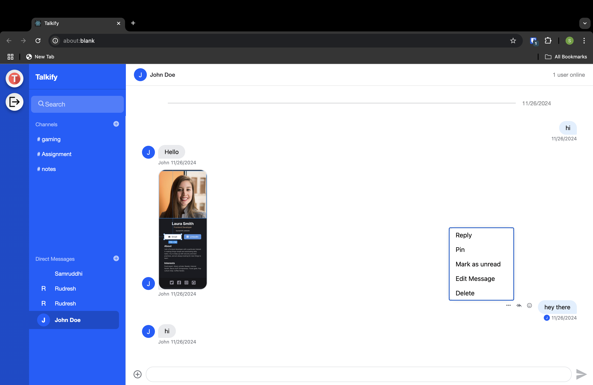
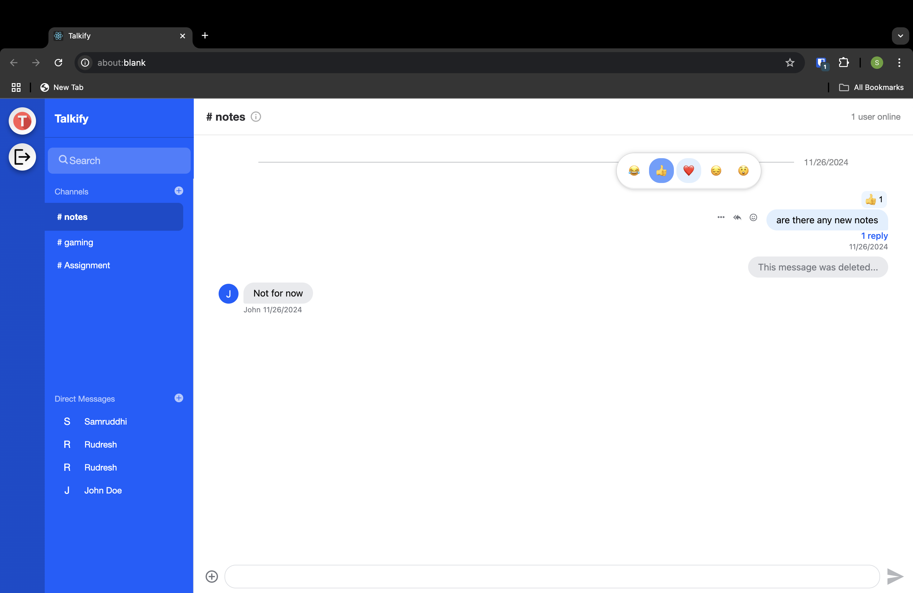
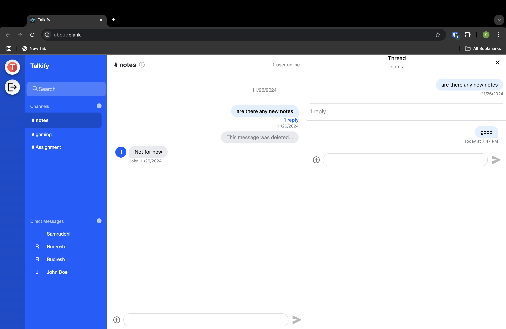
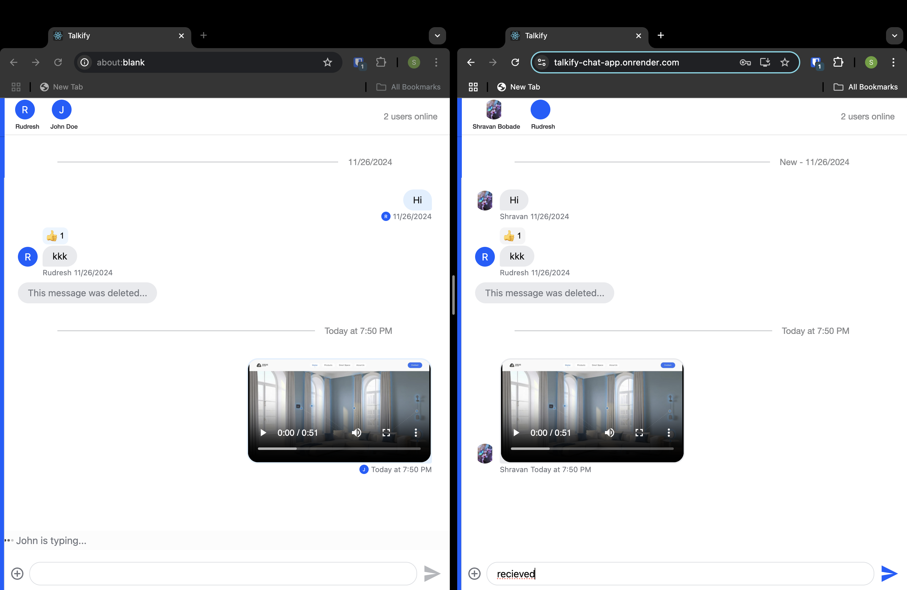

# ChatApp

A real-time chat application with features like text messaging, reactions, user authentication, media sharing, and more.

## Features

- **User Authentication**: Secure login and signup functionality with fields for full name, username, phone number, avatar URL, and password.
- **Real-Time Messaging**: Exchange messages instantly with other users.
- **Message Reactions**: React to messages with emojis.
- **Channel and Direct Messages**: Support for group channels and private direct messaging.
- **Media Sharing**: Share images and videos within the chat.
- **Message Deletion**: Delete messages with placeholders indicating removed content.
- **User Status**: Display the number of users online.
- **Responsive Design**: Optimized for desktop and mobile devices.

## Screenshots

### Sign-Up Page


### Sign-In Page


### Chat Interface





### Channels and Direct Messages



## Technologies Used

- **Frontend**: React.js, HTML, CSS
- **Backend**: Node.js, Express
- **Real-Time Communication**: Stream.IO
- **Notifications and SMS**: Twilio
- **Deployment**: Render

## Installation

1. **Clone the Repository**:

   ```bash
   git clone https://github.com/Shravan250/ChatApp.git
   ```

2. **Install dependencies**:

   ```bash
   npm install
   ```

3. **Run the Application**:

   ```bash
   npm start
   ```

4. **Build for Production**:

   ```bash
   npm run build
   ```

## 🔄Deployment

The app is currently deployed using Render. To deploy your own version, follow these steps:

1. Sign up on Render.
2. Link your GitHub repository.
3. Configure the build and deploy settings for a React app.

## 🤝 Contributing

Contributions are welcome! If you'd like to contribute:

1. Fork the repository.
2. Create a new branch.
3. Submit a pull request with your changes.

We appreciate any contributions that help make this project better!

## 📄 License

This project is licensed under the MIT License. Feel free to use and modify it as needed.

---
